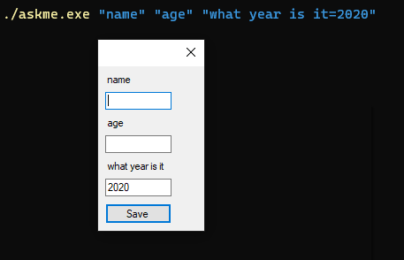

# AskMe

A simple program to prompt questions and dump answers to console as JSON.

Download binary files from [Releases](https://github.com/abdusco/askme/releases/latest)

## Usage

Each argument is parsed as a question. You can specify a default answer with `$question=$answer`.
A question can be prefixed with a key as `key:q=a` to specify a key for that answer.

```powershell
./askme.exe "name" "age=5" "year:what year is it=2020"
```



Hit `[Enter]` or click **Save** to accept values. Hit `[ESC]` to cancel.

output: 

```json
{"name":"abdus","age":"27","year":"2020"}
```

## Changelog

### 2.0

- Rewrite as WPF application